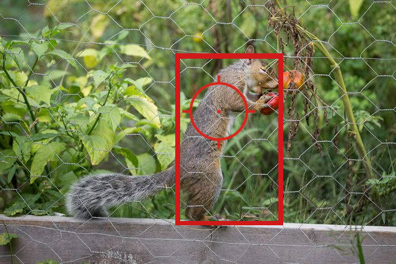

Pest Paladin
===============

Software for Raspberry Pi "Pest Paladin" project using AT&T M2X and Flow.

### To run web server:

```
cd web
../hls/start_server.sh
```


### To run RTSP to HLS converter:

```
cd hls
./start_stream.sh
```

### To test video input:

```
./take_frame.sh
```

### To run object recognition:

```
./OpenCV-ffmpg-example.py
```

### Notes
* The web camera and AT&T services require unique credentials and configuration.
